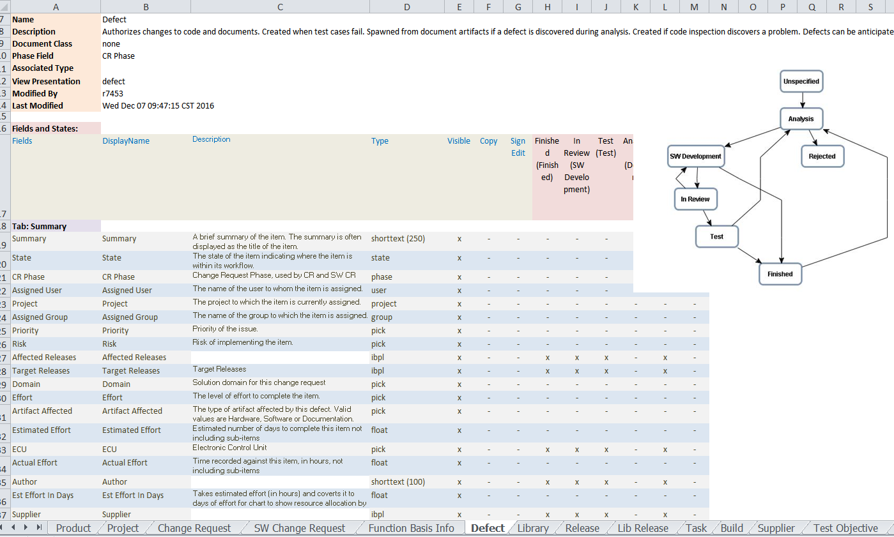

# IntegrityAdminTypeFields
Creates Excel Sheets with details for Types, Fields, Workflow, related Triggers, etc. (similar to IntegrityDocs)

## Overview
This solution extracts the type definition from Integrity Admin and creates Excel Sheets with the details similar to IntegrityDocs.
The advantage is that you can directly update the definitions in Excel wheny you are sitting in a meeting with the customer. 

## Tested with:
- Integrity 10.6
- Integrity 10.8
- Integrity 10.9

##  Development Environment
- PTC Integrity LM 10.9
- Netbeans 7.4 (or 8)
- Java 1.7 (or 1.8)

## Installation Instruction:

* Create the Directory C:\IntegrityAdminExport
* Create the Directory C:\IntegrityAdminExport\images
* Put the files from "dist" folder into C:\IntegrityAdminExport
* Make sure that you have also mksapi.jar and mksclient.jar with the right version in your C:\IntegrityAdminExport\lib folder 
* Put the Template File from docs/Integrity_TypeFields_Template.xlsx directly into C:\IntegrityAdminExport
* Put the run.bat into C:\IntegrityAdminExport
* Open the run.bat and update the server and login credentials

## How To Run
* Execute the run.bat
* In case of error messages regarding missing images, just run the "run.bat" again (known issue)

## Result
As an Output you will get Integrity_TypeFields_Set1.xlsx, Integrity_TypeFields_Set2.xlsx etc. in C:\IntegrityAdminExport

Looking forward to your suggestions, ideas, feedback.
